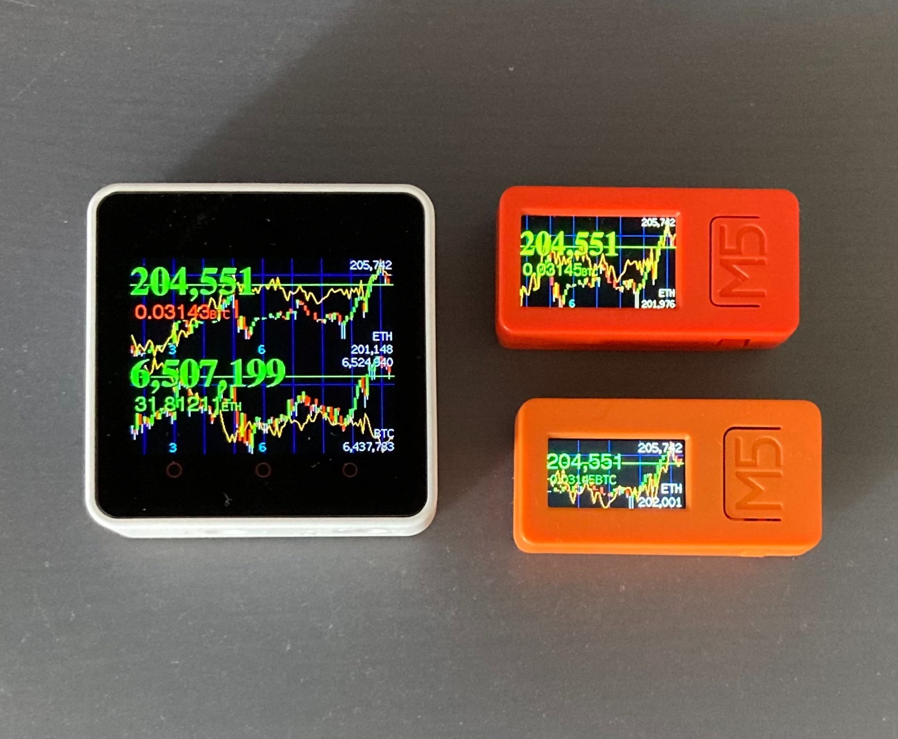

# CryptoCurrencyCandlesticks



This is a program which turns an ESP32 device with color LCD display (M5Stack family and TTGO) into a candlestick display terminal for Ethereum. At this point, it just supports the pair of {Ethereum | Bitcoin} and Japanese Yen.

This program uses Bitbank's public API to obtain candlesticks. The specifications of the API are shown at: https://github.com/bitbankinc/bitbank-api-docs
This program uses public candlestick API written here: https://github.com/bitbankinc/bitbank-api-docs/blob/master/public-api.md
You do not have to obtain API key to access the API.

## Requirements

The following are required to compile and run this program:

- M5Stack, M5StickC (Plus) or TTGO-T-Display
- M5Stack or TTGO-T-Display library for Arduino. For example, TTGO-T-Display library can be downloaded from: https://github.com/Xinyuan-LilyGO/TTGO-T-Display
- ArduinoJson library which can be downloaded from: https://arduinojson.org/
- Root certification for bitbank.cc which is already included within this source code.
- Arduino IDE to compile and transfer the compiled executable into ESP32 device.
- WiFi access information which should be placed in auth.h (not included in this repository) which includes the following information:

```
#define WIFIAP "your WiFi access point name"
#define WIFIPW "your WiFi access point password"
```

## Future updates

I do not have any plan to support any other currency nor fiat currencyn than Ethereum and Bitcoin. In addition, I do not have any plan to support any other API provided by other Cryptocurrency exchanges.
